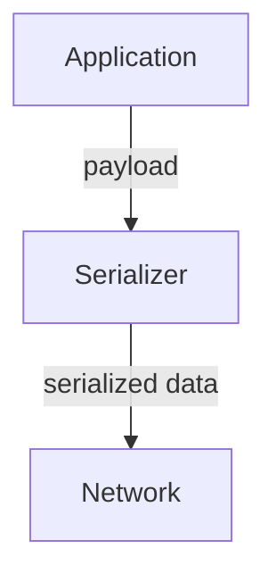
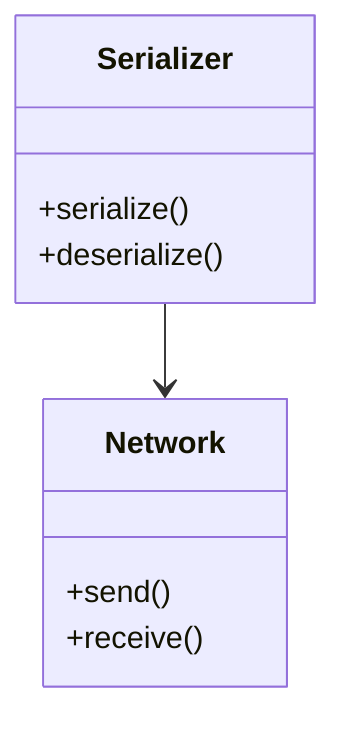
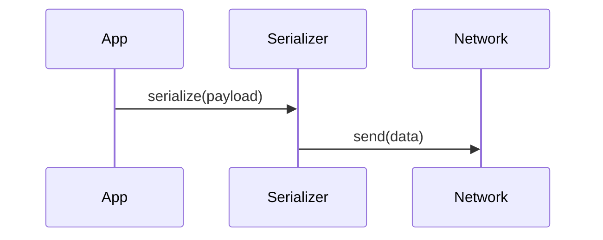

# Design for User Story <ID>: <Short Title>

**Owner:** <Your Name>  
**Date:** <YYYY-MM-DD>

---

## Context

Briefly describe **what problem this design solves**.

Example:  
This design describes the serializer component that encodes data structures into SOME/IP messages as per the Autosar spec.

---

## Goals

- List the **outcomes you want**.
- Be clear about **what success looks like**.

Example:
- Support serialization and deserialization of all standard payload types.
- Fail gracefully on invalid configurations.
- Keep latency below 2ms per message.

---

## Approach

Explain **how you plan to do it**.

- Libraries or frameworks used.
- Patterns you follow (e.g., Strategy, Builder).
- Any standards or conventions applied.

Example:
- Use a `Serializer` class with pluggable transformers.
- Validate configuration at startup.
- Log errors to the system logger.

---

## High-Level Design

Explain **the structure in plain words**.

- What components/classes/functions exist?
- How do they talk to each other?

---

## Diagrams

**Flowchart (Data Flow):**

---

**Class Diagram:**

---

**Sequence Diagram:**

---

## Key Decisions

- Using a fixed-size buffer to avoid dynamic allocation.
- Fallback to default configuration if missing.

---

## Risks and Open Questions

- Potential performance issues with large payloads.
- Behavior if schema evolves.

---

## Test Strategy

- Unit tests for encoding and decoding logic.
- Integration tests sending real messages over the network.
- Fuzz testing with malformed payloads to ensure robustness.

---

## References

- [Autosar TPS]
- User Story #<ID>
- Any relevant specifications or prior design documents.
